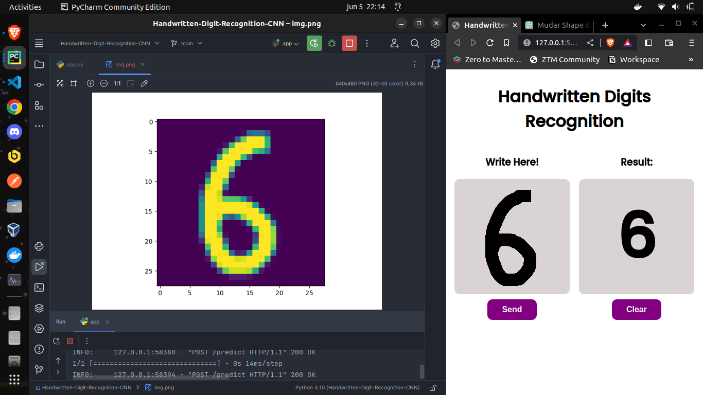
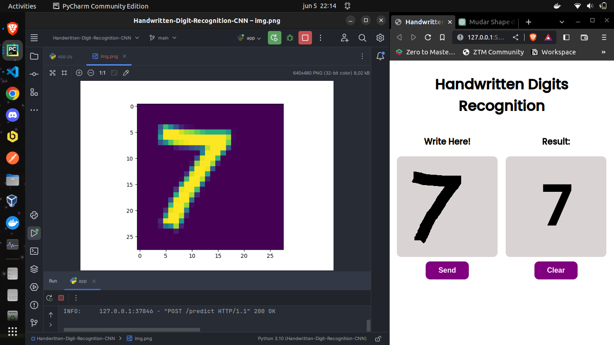

<h1 align="center">Handwritten Digit Recognition with CNN</h1>

Front-end of the project: [Repository](https://github.com/kauasdev/Handwritten-Digit-Recognition-with-CNN-Front-)

### Technologies used

- [TensorFlow](https://www.tensorflow.org/)
- [Keras](https://keras.io/)
- [FastAPI](https://fastapi.tiangolo.com/)
- [Pillow](https://pillow.readthedocs.io/en/stable/?badge=latest#)
- [Numpy](https://numpy.org/)

-----
## Packages install
    pip install -r requirements.txt
## Run API
#### Run app.py
    python3 app.py  # Runs on port 2940
#### or 
    uvicorn app:app --host=0.0.0.0 --port=PORT
## Model
#### Load model
    model = tf.keras.models.load_model('model.h5')
#### Rebuild and retrain the model
    python3 model.py
https://github.com/kauasdev/Handwritten-Digit-Recognition-with-CNN-Front-
## Examples

  
